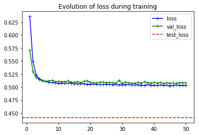
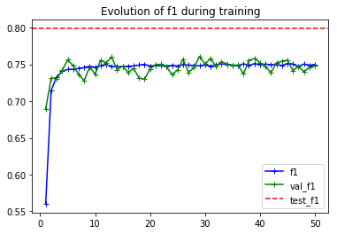
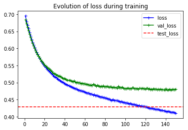
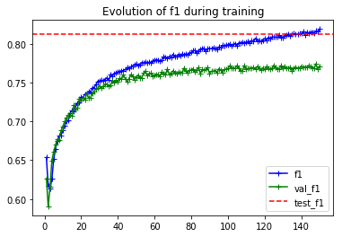
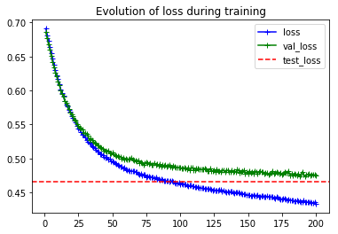
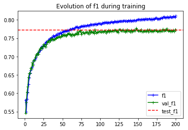

# Sentiment Analysis on Twitter Dataset (Sentiment140)

### Ester Hlav
### Oct 6, 2019

### Objective:
Sentiment Analysis on a subset of dataset with Twitter posts (aka Sentiment140).

### Method:
Used pretrained GloVe embedding vectors of dimension 200 (trained on Twitter) to perform a binary sentiment classification task. Restricted train data to 25,000 samples, validation data to 8,000 samples. Test data contains 358 samples.

Models:
1. MLP with average-pooled GloVe embeddings

2. CNN with sequential GloVe embeddings

3. CNN with fine-tuned embeddings

Next steps (in progress):

4. CNN with learned character-level embeddings (in addition to sequential GloVe embeddings)

5. MLP with BERT embeddings trained on masked language model on entire Twitter dataset (1.6m tweets)

### Results:

| Val performance (8K samples)             |  Loss | Accuracy | Precision | Recall | F1-score |
|-------------------------------|:-----:|:--------:|:---------:|--------|----------|
| MLP (~30K params)                  | 0. 508|   0.750  |   0.764   |  0.722 |   0.741  |
| CNN (~33K params)             | 0.479 |   0.769  |   0.765   |  **0.775** |   0.768  |
| CNN with fine-tune embedding (~2.6M params)  | **0.475** |   **0.772**  |   **0.773**   |  0.767 |   **0.769**  |

| Test performance  (358 samples)            |  Loss | Accuracy | Precision | Recall | F1-score |
|-------------------------------|:-----:|:--------:|:---------:|--------|----------|
| MLP (~30K params)                  | 0.441 |   0.787  |   0.767   |  0.836 |   0.799  |
| CNN (~33K params)             | **0.429** |   **0.801**  |   **0.780**   |  **0.847** |   **0.812**  |
| CNN with fine-tune embedding (~2.6M params)  | 0.465 |   0.757  |   0.735   |  0.818 |   0.772  |

We observe that the MLP with average-pooled GloVe embeddings is a strong baseline for a sentiment prediction task on Twitter Sentiment140 data. This can be expected, as the used GloVe embeddings are trained on Twitter data and we used a similar preprocessing for Sentiment140 tweets.
CNN with sequential GloVe embeddings model achieves somewhat higher performance due to the contextualized nature, which is further improved on the validation set by the fine-tuned embeddings model. However, due to the very low number of samples in the test set, the bad performance of the fine-tuned embedding on the test set are not very concerning. With more elaborate fine-tuning and more data, we could potentially obtain even better results and outperform further the base CNN.

**Training curves for MLP model:**

 

**Training curves for CNN model:**

 

**Training curves for CNN with fine-tuned embeddings model:**

 

### Run Code:
Open SentimentAnalysisTwitter_PyTorch.ipynb
